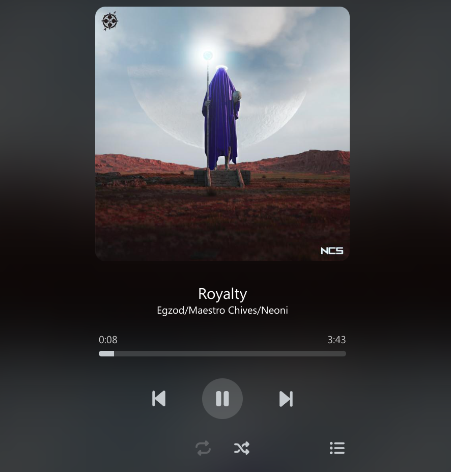

# SimpleWebMusicPlayer

A simple static web music player.

- Dynamic theme color.
- Static web page.
- Extract cover art and title/artist information (if the mp3 file contains any of that).
- Media control integration.

## Demo

[Demo](https://cf.derg.cc)




## Usage

### 1. Download this repo

### 2. Install `python3`

### 3. Install requirements

```bash
pip install -r requirements.txt
```

### 4. Put your mp3 files in `files` folder

### 5. Build web page

- windows: run `build.bat`

- linux: run `build.sh`

- or use python:
```
python ./build.py
```


### The output web page should be in `build` folder.

